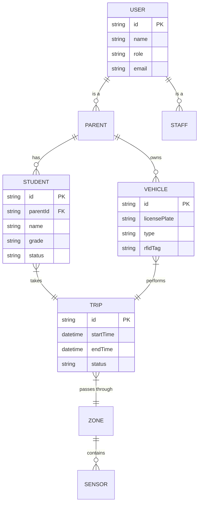

# FLUXGATE System Entity Relationship Diagram

```mermaid
erDiagram
    USER ||--o{ PARENT : "is a"
    USER ||--o{ STAFF : "is a"
    
    PARENT ||--o{ STUDENT : "has"
    PARENT ||--o{ VEHICLE : "owns"
    
    STUDENT }|--|| TRIP : "takes"
    VEHICLE }|--|| TRIP : "performs"
    
    TRIP }|--|| ZONE : "passes through"
    ZONE ||--o{ SENSOR : "contains"
    
    USER {
        string id PK
        string name
        string role
        string email
    }

    STUDENT {
        string id PK
        string parentId FK
        string name
        string grade
        string status
    }

    VEHICLE {
        string id PK
        string licensePlate
        string type
        string rfidTag
    }

    TRIP {
        string id PK
        datetime startTime
        datetime endTime
        string status
    }
```
