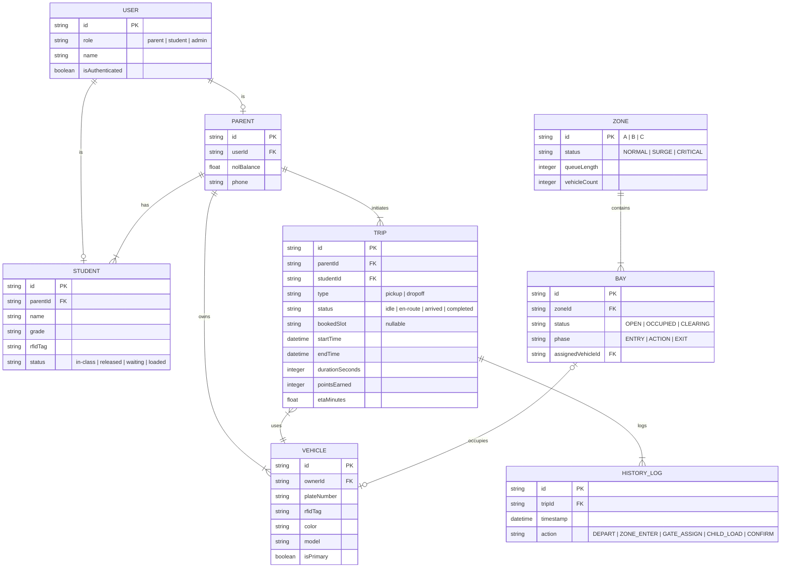

# NEXUS: Comprehensive System Architecture

This content provides a deep technical overview of the NEXUS Traffic & Logistics Command Center, including Data Models and Sequence Interactions.

---

## 1. System Entity Relationship Diagram (ERD)

The following diagram illustrates the core data structure driving the NEXUS applications, Command Center, and Nexus Companion App.

---

## 2. Sequence Diagrams

### 2.1 Parent Pickup Flow (Happy Path)

This sequence covers the standard "Leave Now" flow from the Parent App to child retrieval.

### 2.2 Scheduled Pickup Flow (Timeslot Booking)

This sequence illustrates the new "Timeslot" feature logic.

### 2.3 Student Status Updates (School to App)

How the Student App and Parent App stay in sync.

## 3. Core Logic Flowchart (System Brain)

The central logic governing the `NexusContext` simulation engine.

