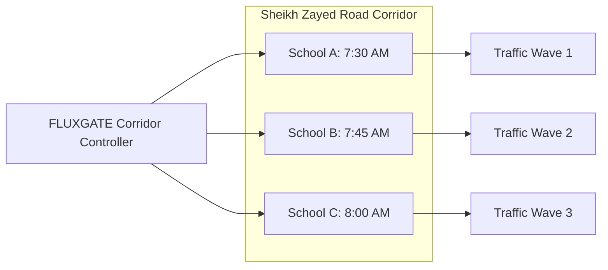
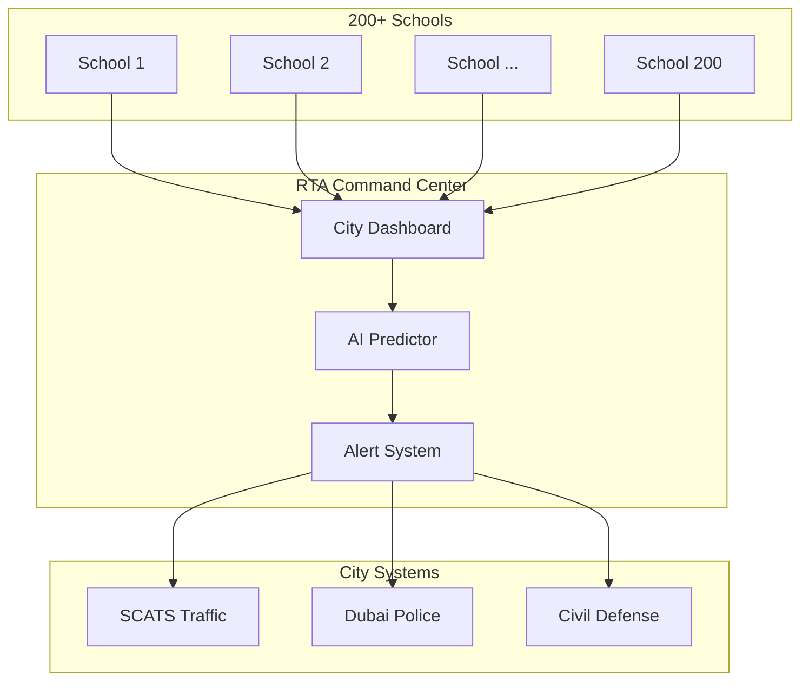

# 🗺️ RTA FLUXGATE: Future Roadmap
## Strategic Extensions & Long-Term Vision

---

## Executive Summary

FLUXGATE Phase 1 solves the immediate problem: **school zone congestion**. But the platform's architecture enables much larger possibilities. This roadmap outlines the evolution from a single-school solution to a **city-wide intelligent mobility network**.

---

## 🔄 Implementation Flowchart

```
╔══════════════════════════════════════════════════════════════════════════════════════════════════════════════════╗
║                                                                                                                  ║
║                              ███████╗██╗     ██╗   ██╗██╗  ██╗ ██████╗  █████╗ ████████╗███████╗                 ║
║                              ██╔════╝██║     ██║   ██║╚██╗██╔╝██╔════╝ ██╔══██╗╚══██╔══╝██╔════╝                 ║
║                              █████╗  ██║     ██║   ██║ ╚███╔╝ ██║  ███╗███████║   ██║   █████╗                   ║
║                              ██╔══╝  ██║     ██║   ██║ ██╔██╗ ██║   ██║██╔══██║   ██║   ██╔══╝                   ║
║                              ██║     ███████╗╚██████╔╝██╔╝ ██╗╚██████╔╝██║  ██║   ██║   ███████╗                 ║
║                              ╚═╝     ╚══════╝ ╚═════╝ ╚═╝  ╚═╝ ╚═════╝ ╚═╝  ╚═╝   ╚═╝   ╚══════╝                 ║
║                                                                                                                  ║
║                                    IMPLEMENTATION ROADMAP FLOWCHART                                              ║
║                                                                                                                  ║
╠══════════════════════════════════════════════════════════════════════════════════════════════════════════════════╣
║                                                                                                                  ║
║    ┌─────────────────────────────────────────────────────────────────────────────────────────────────────────┐   ║
║    │                                        PHASE 1: FOUNDATION                                              │   ║
║    │                                         Q1-Q2 2026 (Now)                                                │   ║
║    └─────────────────────────────────────────────────────────────────────────────────────────────────────────┘   ║
║                                                      │                                                           ║
║           ┌──────────────────────────────────────────┼──────────────────────────────────────────┐                ║
║           │                                          │                                          │                ║
║           ▼                                          ▼                                          ▼                ║
║    ┌──────────────┐                          ┌──────────────┐                          ┌──────────────┐          ║
║    │  🧠 CORE     │                          │  📱 MOBILE   │                          │  🖥️ DASHBOARD │          ║
║    │  ALGORITHMS  │                          │     APP      │                          │   + BOLLARDS  │          ║
║    ├──────────────┤                          ├──────────────┤                          ├──────────────┤          ║
║    │ • SAS Engine │                          │ • Parent UI  │                          │ • Live Twin  │          ║
║    │ • LDS System │                          │ • Push Notif │                          │ • Gate Ctrl  │          ║
║    │ • VQS Queue  │                          │ • QR Check-in│                          │ • Bay Status │          ║
║    │ • FLGC Logic │                          │ • NOL Wallet │                          │ • Analytics  │          ║
║    └──────┬───────┘                          └──────┬───────┘                          └──────┬───────┘          ║
║           │                                          │                                          │                ║
║           └──────────────────────────────────────────┼──────────────────────────────────────────┘                ║
║                                                      │                                                           ║
║                                                      ▼                                                           ║
║                                        ┌─────────────────────────┐                                               ║
║                                        │    🏫 PILOT SCHOOLS     │                                               ║
║                                        │      (1-3 Schools)      │                                               ║
║                                        │   ✓ Validate Concept    │                                               ║
║                                        │   ✓ Gather Metrics      │                                               ║
║                                        └────────────┬────────────┘                                               ║
║                                                     │                                                            ║
║    ══════════════════════════════════════════════════════════════════════════════════════════════════════════    ║
║                                                     │                                                            ║
║                                                     ▼                                                            ║
║    ┌─────────────────────────────────────────────────────────────────────────────────────────────────────────┐   ║
║    │                                       PHASE 2: SCALE & INTEGRATE                                        │   ║
║    │                                            6-12 Months                                                  │   ║
║    └─────────────────────────────────────────────────────────────────────────────────────────────────────────┘   ║
║                                                     │                                                            ║
║        ┌────────────────────────────────────────────┼────────────────────────────────────────────┐               ║
║        │                                            │                                            │               ║
║        ▼                                            ▼                                            ▼               ║
║    ┌─────────────────┐                     ┌─────────────────┐                      ┌─────────────────┐          ║
║    │  🛣️ CORRIDOR     │                     │  🚇 TRANSIT     │                      │  📊 ATTENDANCE  │          ║
║    │  ORCHESTRATION  │                     │     SYNC        │                      │   INTEGRATION   │          ║
║    ├─────────────────┤                     ├─────────────────┤                      ├─────────────────┤          ║
║    │ Multi-school    │                     │ Metro arrival   │                      │ Auto-cancel     │          ║
║    │ coordination    │                     │ times sync      │                      │ absent slots    │          ║
║    │ on same road    │────────────────────▶│ Bus schedule    │─────────────────────▶│ 10-15% capacity │          ║
║    │                 │                     │ integration     │                      │ optimization    │          ║
║    └─────────────────┘                     └─────────────────┘                      └────────┬────────┘          ║
║                                                                                              │                   ║
║                                                                                              ▼                   ║
║                                                                                   ┌─────────────────┐            ║
║                                                                                   │  🎯 50+ SCHOOLS │            ║
║                                                                                   │    DEPLOYED     │            ║
║                                                                                   └────────┬────────┘            ║
║                                                                                            │                     ║
║    ══════════════════════════════════════════════════════════════════════════════════════════════════════════    ║
║                                                                                            │                     ║
║                                                                                            ▼                     ║
║    ┌─────────────────────────────────────────────────────────────────────────────────────────────────────────┐   ║
║    │                                      PHASE 3: INTELLIGENCE LAYER                                        │   ║
║    │                                            12-24 Months                                                 │   ║
║    └─────────────────────────────────────────────────────────────────────────────────────────────────────────┘   ║
║                                                     │                                                            ║
║        ┌────────────────────────────────────────────┼────────────────────────────────────────────┐               ║
║        │                                            │                                            │               ║
║        ▼                                            ▼                                            ▼               ║
║    ┌─────────────────┐                     ┌─────────────────┐                      ┌─────────────────┐          ║
║    │  🌧️ WEATHER     │                     │  🤖 AI TEACHER  │                      │  🌿 CARBON      │          ║
║    │   PROTOCOLS     │                     │   PREDICTION    │                      │   MARKETPLACE   │          ║
║    ├─────────────────┤                     ├─────────────────┤                      ├─────────────────┤          ║
║    │ Rain/Heat/Storm │                     │ ML model for    │                      │ Track verified  │          ║
║    │ auto-triggers   │                     │ dismissal delay │                      │ CO2 reduction   │          ║
║    │ adaptive rules  │────────────────────▶│ prediction      │─────────────────────▶│ AED 30K/school  │          ║
║    │                 │                     │                 │                      │ /year credits   │          ║
║    └─────────────────┘                     └─────────────────┘                      └────────┬────────┘          ║
║                                                                                              │                   ║
║                                                                                              ▼                   ║
║                                                                               ┌───────────────────────┐          ║
║                                                                               │  ⏱️ 1M HOURS SAVED    │          ║
║                                                                               │     CITY-WIDE/YEAR    │          ║
║                                                                               └───────────┬───────────┘          ║
║                                                                                           │                      ║
║    ══════════════════════════════════════════════════════════════════════════════════════════════════════════    ║
║                                                                                           │                      ║
║                                                                                           ▼                      ║
║    ┌─────────────────────────────────────────────────────────────────────────────────────────────────────────┐   ║
║    │                                       PHASE 4: CITY-WIDE VISION                                         │   ║
║    │                                             24+ Months                                                  │   ║
║    └─────────────────────────────────────────────────────────────────────────────────────────────────────────┘   ║
║                                                     │                                                            ║
║        ┌────────────────────────────────────────────┼────────────────────────────────────────────┐               ║
║        │                                            │                                            │               ║
║        ▼                                            ▼                                            ▼               ║
║    ┌─────────────────┐                     ┌─────────────────┐                      ┌─────────────────┐          ║
║    │  🏛️ RTA COMMAND │                     │  🚗 AUTONOMOUS  │                      │  🏆 GAMIFICATION │          ║
║    │     CENTER      │                     │    VEHICLES     │                      │       2.0       │          ║
║    ├─────────────────┤                     ├─────────────────┤                      ├─────────────────┤          ║
║    │ 200+ schools    │                     │ V2I API for     │                      │ Family leaders  │          ║
║    │ monitored       │                     │ Tesla/Waymo     │                      │ Class awards    │          ║
║    │ Real-time city  │────────────────────▶│ 5G bollard      │─────────────────────▶│ Kids dashboard  │          ║
║    │ rebalancing     │                     │ communication   │                      │ Annual prizes   │          ║
║    └─────────────────┘                     └─────────────────┘                      └────────┬────────┘          ║
║                                                                                              │                   ║
║                                                                                              ▼                   ║
║                                            ╔═════════════════════════════════════╗                               ║
║                                            ║                                     ║                               ║
║                                            ║   🎯 ULTIMATE OUTCOMES              ║                               ║
║                                            ║                                     ║                               ║
║                                            ║   ✓ 200+ Schools Connected          ║                               ║
║                                            ║   ✓ 10,000 Tonnes CO2 Saved/Year    ║                               ║
║                                            ║   ✓ Dubai's Safest School Zones     ║                               ║
║                                            ║   ✓ AV-Ready Infrastructure         ║                               ║
║                                            ║                                     ║                               ║
║                                            ╚═════════════════════════════════════╝                               ║
║                                                                                                                  ║
╠══════════════════════════════════════════════════════════════════════════════════════════════════════════════════╣
║                                                                                                                  ║
║    INVESTMENT TIMELINE                                                                                           ║
║    ══════════════════                                                                                            ║
║                                                                                                                  ║
║    Phase 1          Phase 2           Phase 3            Phase 4                                                 ║
║    AED 300K         AED 1.5M          AED 2M             AED 10M                                                 ║
║       │                │                 │                  │                                                    ║
║       ▼                ▼                 ▼                  ▼                                                    ║
║    ───●────────────────●─────────────────●──────────────────●───────────────────▶                                ║
║       │                │                 │                  │                   TIME                             ║
║    0 months         6 months          12 months          24 months                                               ║
║                                                                                                                  ║
║    ROI: 500%+         ROI: 400%         ROI: 300%          ROI: Strategic                                        ║
║                                                                                                                  ║
╚══════════════════════════════════════════════════════════════════════════════════════════════════════════════════╝
```

---

## Phase 1: Foundation (Current)
**Timeline:** Hackathon → Pilot (Q1-Q2 2026)

| Deliverable | Status |
|-------------|--------|
| Core Algorithms (SAS, LDS, VQS, FLGC) | ✅ Designed |
| Mobile App (Parent) | ✅ Specified |
| School Dashboard | ✅ Specified |
| Bollard Integration | ✅ Specified |
| NOL Gamification | ✅ Specified |

**Goal:** Prove concept at 1-3 pilot schools.

---

## Phase 2: Scale & Integrate (6-12 Months)

### 2.1 Multi-School Corridor Orchestration
**Problem:** Schools on the same road cause cascading traffic.



**Impact:** Prevent overlapping traffic waves from 5+ schools.

---

### 2.2 Public Transit Sync
**Problem:** Parents arriving by Metro are not considered.

| Integration | Benefit |
|-------------|---------|
| Metro arrival times | Adjust slot based on walking ETA from station |
| Bus schedules | Coordinate school bus with dismissal waves |
| Careem/Taxi ETAs | Include ride-hail in queue system |

---

### 2.3 Predictive Absence Detection
**Problem:** System schedules slots for absent students.

**Solution:**
- Integrate with school attendance systems.
- Auto-cancel slots for absent students by 7:00 AM.
- Redistribute freed capacity to waitlist.

**Impact:** 10-15% capacity optimization on typical sick days.

---

## Phase 3: Intelligence Layer (12-24 Months)

### 3.1 Weather-Triggered Protocols
**Problem:** Rainy/hot days = different pickup behavior.

| Weather | Trigger | Protocol Change |
|---------|---------|-----------------|
| Rain | UAE Met Alert | Extend dwell times, covered zones only |
| Extreme Heat (>45°C) | Temperature sensor | Indoor staging, AC buses first |
| Sandstorm | Visibility <1km | Delay all departures, SMS fallback |

---

### 3.2 AI Teacher Delay Prediction
**Problem:** Some classes are always dismissed late.

**Solution:**
- ML model trained on historical dismissal patterns.
- Predict 3-5 min delays for specific teachers.
- Pre-adjust parent ETAs accordingly.

---

### 3.3 Carbon Credit Marketplace
**Problem:** CO2 savings are not monetized.

**Solution:**
- Track verified emissions reduction per school.
- Convert to carbon credits (UAE Green Economy standards).
- Sell credits to offset programs or reinvest in schools.

| Metric | Value |
|--------|-------|
| CO2 saved per school/year | 100+ tonnes |
| Carbon credit value | ~AED 30,000/year |

---

## Phase 4: City-Wide Vision (2+ Years)

### 4.1 Dubai School Traffic Command Center



**Features:**
- Real-time monitoring of all school zones.
- Automatic incident detection and response.
- City-wide traffic rebalancing during school hours.

---

### 4.2 Autonomous Vehicle Integration

**Problem:** AVs can't use parent apps.

**Solution:**
- V2I (Vehicle-to-Infrastructure) API.
- Bollards communicate directly with Tesla/Waymo.
- AVs receive gate commands via 5G.

---

### 4.3 Gamification 2.0

| Feature | Description |
|---------|-------------|
| Family Leaderboards | Cross-school competitions |
| Class Challenges | "Greenest Class" weekly awards |
| Annual Awards | "Dubai's Safest School Zone" |
| Kids Dashboard | Children see family's impact in class |

---

## Investment Summary

| Phase | Timeline | Investment | ROI |
|-------|----------|------------|-----|
| Phase 1 (Pilot) | 0-6 months | AED 300K | 500%+ |
| Phase 2 (Scale) | 6-12 months | AED 1.5M | 400% |
| Phase 3 (Intelligence) | 12-24 months | AED 2M | 300% |
| Phase 4 (City-Wide) | 24+ months | AED 10M | Strategic |

---

## Risk Mitigation

| Risk | Probability | Mitigation |
|------|-------------|------------|
| Low parent adoption | Medium | Strong gamification, school enforcement |
| Technical failure | Low | Graceful degradation, manual fallback |
| Regulatory changes | Low | Privacy-first design, RTA partnership |
| Competition | Medium | First-mover advantage, RTA exclusivity |

---

## Success Metrics by Phase

| Phase | KPI | Target |
|-------|-----|--------|
| 1 | Congestion reduction | 50% |
| 2 | Schools deployed | 50+ |
| 3 | City-wide time saved | 1M hours/year |
| 4 | CO2 reduction | 10,000 tonnes/year |

---

*RTA FLUXGATE Roadmap — Dubai's Future of School Mobility*
